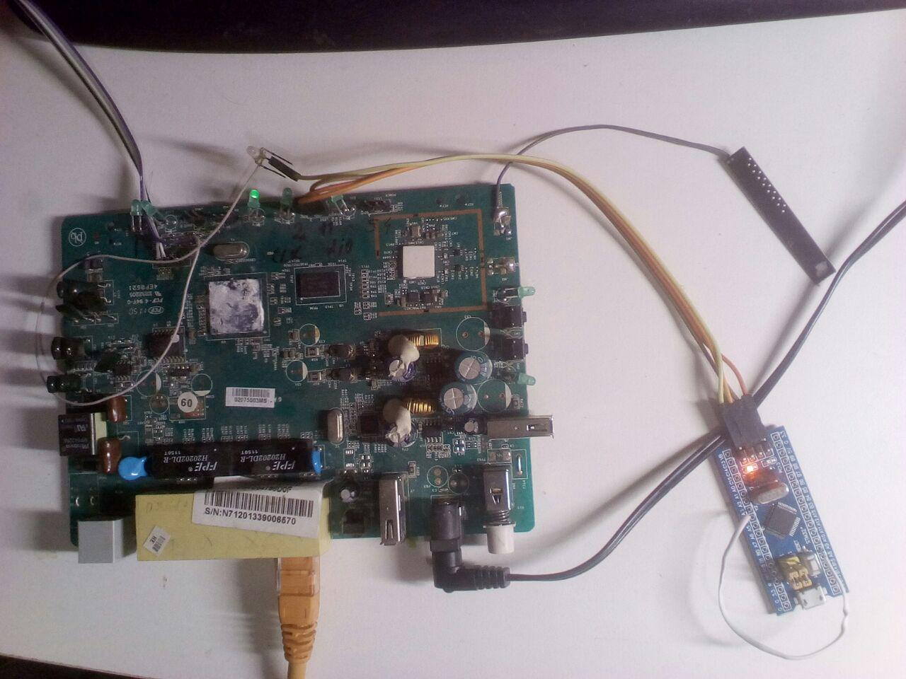
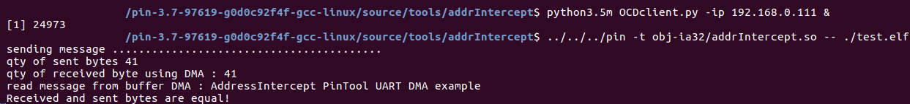

# Address Intercept example UART-DMA

It is example of the using of [AddressIntercept technology](https://github.com/ser-mk/AddressIntercept "AddressIntercept technology")  to run microcontroller programm on host  PC.  AddressIntercept client translate intercepted addresses in microcontroller to write and to read register.

 My test stand
 

 The green board is a Linux machine where ran openOCD server.
 `You may run openOCD server on host PC if use another JTAG/SWD adapter (example st-link)`
 The blue board is a [bluepill](https://www.google.com/search?client=ubuntu&channel=fs&q=bluepill&ie=utf-8&oe=utf-8 "bluepill")
I connected Tx UART1 (PA9 pin) with Rx UART2 (PA3 pin) using the white wire.

My example will be to tune periphery of microcontroller, namely, UART1 UART2 and gpio led (PC13 pin). Then UART1 will send bytes and UART2 will recieve using DMA. Also blink led.
But we run the program on host PC instead microcontroller. We run our program with pintool client, which intercept writing and reading  address of periphery of microcontroller. And then pass this operation to openOCD server using command [mww and mdw](http://openocd.org/doc/html/General-Commands.html "mww and mdw").

Let's build and run it...

We need host PC with Ubuntu 16.04 (tested there) is attached а JTAG/SWD adapter with prepared STM32F103C8 (PA9 pin connected to PA3 pin).

А simple way:

1. Download [pintool v3.7](https://software.intel.com/en-us/articles/pin-a-dynamic-binary-instrumentation-tool "pintool  v3.7") 
2. Unpack archive
3. cd pin-3.7-97619-g0d0c92f4f-gcc-linux/source/tools/
4. git clone git@github.com:ser-mk/AddressIntercept.git
5. cd AddressIntercept
6. make TARGET=obj-ia32
7. git clone git@github.com:ser-mk/AddressIntercept-example-UART-DMA.git
8. cd AddressIntercept-example-UART-DMA
9. make
10. cd - # to  pin-3.7-97619-g0d0c92f4f-gcc-linux/source/tools/
11. mkfifo in.fifo out.fifo
12. python3.5m OCDclient.py -ip $IP_YOUR_OPENOCD_SERVER &
13. ../../../pin -t obj-ia32/addrIntercept.so -- AddressIntercept-example-UART-DMA/test.elf

and we'll have:
